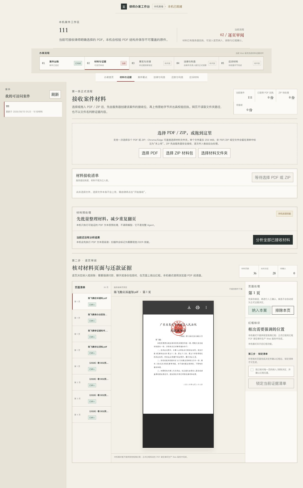

# 律师 Web 办案流程审查

审查日期：2026-08-13  
审查对象：本机 Web 实际运行流程（浏览器入口 `127.0.0.1:33000`）  
审查范围：案件入口、上传后分析、证据复核、后续流程可达性

## 1. 实际走查步骤

1. 打开律师工作台并进入已有案件“111”。
2. 确认案件显示 10 份材料、案件版本 20。
3. 进入“材料与证据”。
4. 读取证据统计：36 页，其中 28 页尚未决定。
5. 点击“分析全部已接收材料”。
6. 页面返回“候选日期格式不正确”，没有形成可进入的候选分组。
7. 检查证据复核区：页面以全量扁平列表呈现，每页分别纳入或排除。
8. 检查案件要点、法律与利息、测算、应诉材料入口：本地服务端明确不支持，但前台仍曾将其展示为流程步骤。

## 2. 截图证据

### 案件入口

界面视觉层级基本清楚，但右侧流程状态实际上已暴露“本机只能做材料”的产品割裂：律师无法在当前案件继续完成事实、法律、计算和导出。

### 逐页证据清单

36 页中的 28 页要求人工决定，列表没有候选组过滤、异常优先、批量确认或抽样复核。此处是“Agent 没有降低律师操作量”的直接证据。

## 3. 主要问题

| 优先级 | 问题 | 用户影响 | 处理方向 |
|---|---|---|---|
| P0 | 本地文本预处理被混称为 Agent | 用户误以为材料已经完成智能分析 | 统一改名为“材料预处理”，生产 Agent 未接通时不显示完成 |
| P0 | 分析协议拒绝空日期/金额数组 | 点击分析直接报错 | 允许受限空数组，仍校验数量、长度和去重 |
| P0 | “进入分组核对”没有分组定位 | 律师仍回到全部 36 页 | 候选绑定 `evidence_page_id`，入口传候选页集合并过滤 |
| P0 | 全量逐页人工决定 | 28 页至少 28 次重复操作，生产模式还可能翻倍 | Agent 先按风险/置信度/冲突分组；低风险同类项批量确认 |
| P0 | 不可完成步骤仍在导航中 | 用户进入死路或误判功能已具备 | 使用服务端 capability 投影驱动导航和按钮 |
| P0 | 启动文档默认 3000 | 该端口实际是另一个产品，可能进入错误应用 | 等待真实就绪并打印唯一端口，默认从 33000 段选择 |
| P1 | 后续 Word/Excel/测算按钮无本地写链 | 点击后必然失败或永远禁用 | 没有真实 API 时隐藏，只在同案写链装配后开放 |

## 4. 视觉和交互判断

### 视觉

- 优点：中文信息密度适合桌面办案，字体和主色克制，没有聊天机器人占据主界面。
- 问题：状态卡和流程步骤把“系统能力边界”放得太靠前，律师需要的“Agent 已做什么、我只需判断什么”不够突出。
- 调整原则：不先做视觉美化；先把首页第一屏改为当前 Agent 任务、异常数量、待律师确认批次和下一步。

### 交互

- 页面反馈没有形成“启动任务 → 运行中 → 候选就绪 → 只审异常”的闭环。
- 不可用步骤应是不可交互状态，不应因当前 URL 而显示“当前”。
- 批量操作必须显示影响页数、候选类型和版本，提交前一次确认，并支持在锁定前撤销。
- 每个候选必须可直达原页；源页不可用时禁止确认。

## 5. 可访问性边界

本次为截图和主路径交互审查，不是完整 WCAG 合规测试。已能观察到的要求：

- 禁用步骤需同时有文字状态和 `aria-disabled`，不能只靠颜色；
- 运行状态与错误信息使用可被辅助技术感知的 live region/alert；
- 批量候选的复选框、组标题、影响数量和确认按钮必须支持键盘操作；
- 红框坐标编辑需要键盘替代方式，不能只依赖拖拽；
- 后续须用自动化检查加 Windows Narrator、macOS VoiceOver 做实测。

## 6. 审查结论

当前体验不是完整 Agent 办案产品，而是材料上传与人工证据审阅器。下一轮不应继续增加研究页或表单；唯一合理的优先级是完成“整案 Agent 任务 → 来源绑定候选 → 异常优先 → 批量确认”的真实垂直闭环，并由服务器能力决定律师能看到的流程。

