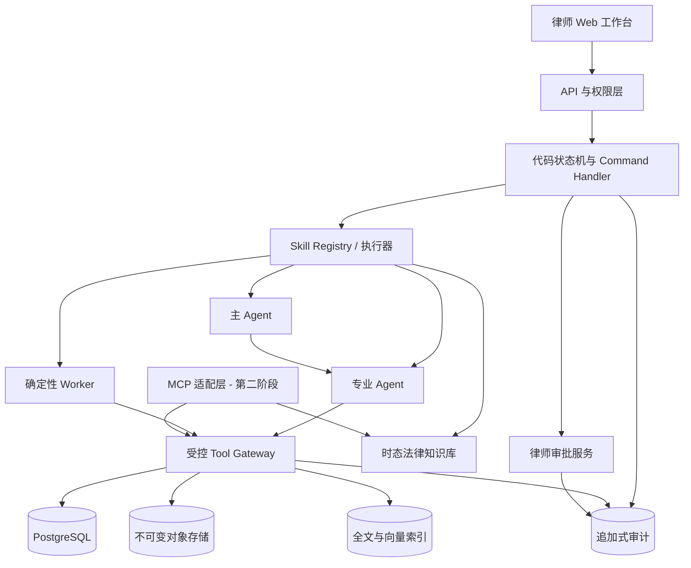
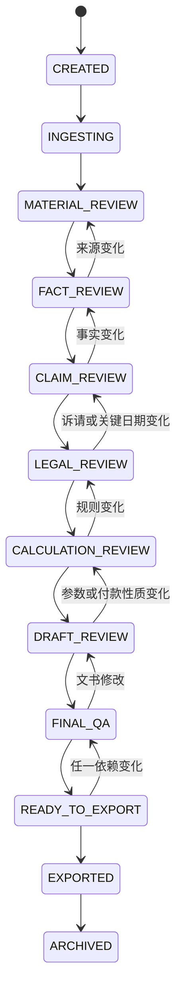

# 系统架构

## 1. 架构结论

第一版采用：

> 模块化单体 + 代码状态机 + 一个主 Agent + 有边界的专业 Agent + 确定性 Worker + 律师审批门。

不采用平级 Agent 自由讨论、投票后直接形成法律结论的自治多 Agent 架构。

## 2. 逻辑架构



## 3. 控制权划分

### 3.1 代码状态机

代码状态机拥有最高控制权，负责：

- 当前案件状态；
- 状态转换前置条件；
- 用户和 Agent 权限；
- 律师审批门；
- 乐观锁、幂等、超时、取消和有界重试；
- 上游变更后的依赖失效；
- 唯一提交版指针；
- 导出、撤销锁定和归档；
- 完整审计。

Agent 永远不能直接更新案件核心表。它只能输出 `ActionProposal`：

```json
{
  "action": "RUN_INTEREST_CALCULATION",
  "matter_id": "matter_xxx",
  "skill_id": "interest_calculation",
  "skill_version": "1.0.0",
  "inputs": {"scenario_id": "scenario_xxx"},
  "reason": "法律规则和付款性质已经获得律师确认",
  "required_approval": "CALCULATION_PARAMETERS",
  "expected_matter_version": 12
}
```

状态机检查 Schema、权限、前置条件和案件版本后，才生成真实 Command。

### 3.2 主 Agent

主 Agent 是律师可见的案件经理，负责：

- 理解自然语言要求；
- 解释当前状态和下一项决定；
- 选择适当 Skill；
- 调用专业 Agent；
- 汇总冲突、缺口和影响范围；
- 将技术状态翻译为律师能够判断的事项。

主 Agent 不负责：

- 修改已确认事实；
- 决定最终诉讼立场；
- 批准法条或计算参数；
- 直接读写通用文件系统；
- 执行金额计算；
- 锁定或提交法院材料。

### 3.3 专业 Agent

| Agent | 输入 | 输出 | 禁止事项 |
|---|---|---|---|
| 事实证据 | 指定页面、OCR、实体候选 | 候选事实和证据映射 | 把 OCR 当作已确认事实 |
| 诉请争点 | 起诉状、已确认事实 | 诉请结构和候选争点 | 替律师承认诉请 |
| 法律研究 | 已确认事实日期、案由、地域 | 候选规则和适用理由 | 引用非白名单为正式法源 |
| 文书起草 | 已批准事实、规则、计算 | 结构化段落 | 引入新事实或重新计算 |
| 对抗审查 | 草稿和依赖图 | 审查发现 | 静默改写律师立场 |

专业 Agent 作为主 Agent 的有界工具运行，不互相自由聊天。它们通过 JSON Schema 和案件对象 ID 传递信息。

### 3.4 确定性 Worker

以下工作必须由代码完成：

- SHA-256、页 ID 和派生件 ID；
- PDF 拆页、渲染、合并、红框和页码；
- 精确去重和候选重复算法；
- 日期和程序期限算法；
- 金额、币种、本息冲抵和利息；
- 文书模板编译和文件校验；
- 跨文书字段一致性；
- 提交包 Manifest 和 ZIP。

## 4. 案件状态机



每个业务状态还可以带运行状态：`PROCESSING`、`NEEDS_DECISION`、`CONFLICTED`、`BLOCKED`、`STALE`、`FAILED_RETRYABLE`、`FAILED_MANUAL`。

语义失败不能靠重复调用模型“碰答案”。

提交包把生命周期、有效性和“当前指针”分开：

```text
Lifecycle: DRAFT → QA_READY → LOCKED → EXPORTED
Validity:  VALID → STALE | REVOKED
Current:   Matter.current_submission_bundle_id → one immutable bundle or null
```

- `LOCKED`、`EXPORTED`、`REVOKED`、`STALE` 的内容和 Manifest 不可覆盖；
- 案件行唯一外键 `current_submission_bundle_id` 保证一个案件最多只有一个 current bundle，`EXPORTED` 仍可保持 current；
- 锁定、新包替换、撤销、上游失效和 current 指针清空在锁定案件行的同一原子事务完成；
- `LOCKED` 或 `EXPORTED` 均可因上游变化转为 `STALE`，或因律师撤销转为 `REVOKED`，同时清除 current 指针；
- `REVOKED` 或 `STALE` 永远不能导出，只能复制依赖后生成新的 `DRAFT`；
- 导出前重新校验 current 指针、全部依赖版本、最终文本哈希、权限和再认证凭证。

## 5. 依赖图与失效传播

每个派生结果保存以下依赖：

```text
WorkProduct
  depends_on Facts [versions]
  depends_on Claims [versions]
  depends_on LegalPropositions [versions]
  depends_on CalculationRun [version]
  generated_by Skill [version]
  generated_by Model/Prompt [versions]
  generated_by Tool [version]
```

示例：律师修改一笔付款的性质。

```text
PaymentClassification 改变
→ CalculationScenario STALE
→ CalculationRun STALE
→ InterestTable STALE
→ Draft paragraphs using totals STALE
→ CalculationMemo STALE
→ SubmissionBundle STALE
```

界面必须显示影响范围，不能只在后台悄悄重算。

## 6. 核心领域模型

### 6.1 组织与权限

`Firm`、`Workspace`、`UserIdentity`、`FirmMembership`、`Role`、`MatterMembership`、`PermissionGrant`。`Firm` 是平台登记的租户根；全局身份与律所成员关系分离，一个身份只有通过有效 `FirmMembership` 才获得该律所内权限。

`Firm` 是唯一数据安全租户；`Workspace/Team` 只做组织分组，不能改变租户边界。对象显式声明 `scope_kind`：

| Scope | 典型对象 | 所有权与可见性 |
|---|---|---|
| `GLOBAL` | 租户根/身份目录、官方法源元数据、系统 Skill/模板版本 | 平台所有；身份目录不含案件内容，业务用户只能读取获授权的已发布资源 |
| `FIRM` | FirmMembership、律所模板、律所规则卡、律所 SourceLicense | 必须有 `firm_id`，`matter_id = null`，仅本律所授权用户可见 |
| `MATTER` | 证据、事实、交易、计算、文书、任务、提交包 | 必须同时有 `firm_id` 和 `matter_id`，且案件必须属于同一律所 |

数据库约束阻止非法 scope/外键组合。RLS 分别按 global 已发布、firm 成员和 matter membership 建立策略；对象键、索引文档、任务、缓存、审计、导出和备份使用同一 scope 上下文。`matter_id` 为空只能出现在白名单 `GLOBAL/FIRM` 对象，必须有独立负向测试。

### 6.2 案件、法院与主体

`Matter`、`MatterStage`、`Court`、`CaseNumber`、`Party`、`PartyRole`、`Identity`、`Alias`、`Account`、`Representation`、`ServiceRecord`、`Deadline`。

### 6.3 文件与证据

`SourceFile`、`EvidencePage`、`EvidenceRegion`、`DerivedArtifact`、`DuplicateGroup`、`EvidenceItem`、`EvidenceLink`、`Annotation`、`ChainOfCustodyEvent`。

### 6.4 事实、诉请和争点

`Fact`、`FactAssertion`、`Claim`、`ClaimResponse`、`Admission`、`DisputeIssue`、`TimelineEvent`、`FactEvidenceLink`、`ReviewDecision`。

事实必须区分：对方主张、本方陈述、Agent 候选、律师确认、争议和否定。

### 6.5 借款与交易

`LoanInstrument`、`LoanDisbursement`、`Transaction`、`TransactionMatch`、`PaymentClassification`、`PaymentAllocation`、`Currency`。

金额必须保存数值、币种、来源和确认状态。付款性质应同时保留对方主张、本方主张、Agent 建议和律师决定。

### 6.6 法律与计算

`AuthorityDocument`、`AuthorityVersion`、`ProvisionVersion`、`EffectivePeriod`、`TransitionRule`、`ApplicabilityRule`、`SourceLicense`、`OfficialSnapshot`、`LegalProposition`、`LegalApproval`、`CaseLegalBundle`、`DeadlineRule`、`DeadlineCalculation`、`CalculationScenario`、`CalculationParameter`、`CalculationRun`、`CalculationPeriod`、`CalculationLineItem`、`CalculationInvariant`。

### 6.7 文书、审批与审计

`DocumentTemplate`、`WorkProduct`、`DocumentVersion`、`Citation`、`ReviewFinding`、`Approval`、`SubmissionBundle`、`ExportRecord`、`ExternalRequestLedger`、`AgentRun`、`SkillRun`、`ToolRun`、`AuditEvent`。

`Approval` 必须绑定 actor、角色/权限快照、授权或委托来源、案件版本、被批准对象及哈希、最终渲染文本哈希、时间和再认证证据。委托过期、离职回收或对象改变会使未执行审批失效。锁定与导出采用可配置职责分离；独任律师例外必须明确声明并留下增强审计。

## 7. API与任务模型

主要 API 域：

```text
/auth /firms /users /matters /files /evidence /facts
/claims /issues /transactions /legal-authorities
/calculation-scenarios /work-products /reviews /approvals
/bundles /jobs /audit-events
```

要求：

- OpenAPI 契约；
- 严格请求响应 Schema；
- 所有写操作携带 `idempotency_key`；
- 所有状态写入携带 `expected_version`；
- 后台进度使用 SSE 或等效单向事件通道；
- 大文件支持分片或断点续传；
- 导出结果返回 Manifest 和校验哈希。

后台任务包括 OCR、页图、重复检测、Agent 抽取、法律检索、文档生成、PDF 检查和 ZIP 打包。

业务状态与任务消息使用事务 Outbox 协调。任务支持幂等、有界重试、超时、取消、进度、心跳、死信和人工恢复。每个 `Run` 固化 `firm_id`、`matter_id`、输入快照、输入对象版本和整体版本指纹；完成结果只能通过 CAS 在事务内应用，版本不符即保存为 `STALE_RESULT`，不得覆盖当前对象。幂等键作用域至少包含租户、案件、命令类型和调用者。

所有外部模型、OCR 与 MCP 请求先写入 `ExternalRequestLedger`，记录授权 preflight、数据字段清单、供应商、地域、保留期、成本/次数上限、请求 ID 和输入哈希。只有 `AUTHORIZED` 请求可发送；`UNKNOWN_SUBMISSION` 不自动重试，必须查询原请求或取得新的人工授权。

## 8. 存储架构

| 存储 | 内容 | 要求 |
|---|---|---|
| PostgreSQL | 案件、状态、权限、审批、依赖、审计索引 | 唯一业务事实源、事务、备份 |
| 对象存储 | 原件、页图、OCR快照、派生件、提交包 | 加密、版本化、生命周期、不可覆盖 |
| 全文/向量索引 | 法律和案件检索索引 | 可重建，不作为法律事实源 |
| Redis/任务层 | 短期进度、缓存、任务消息 | 不保存最终案件状态 |
| 追加审计存储 | 高风险操作日志 | 防篡改、长期保留、可导出 |

PostgreSQL 行级安全可作为多租户隔离的纵深防线，但不能代替 API 层权限检查：[PostgreSQL RLS](https://www.postgresql.org/docs/current/ddl-rowsecurity.html)。

所有数据面统一隔离：

- API 从已验证会话注入 `firm_id`，不接受客户端自报租户作为授权依据；
- RLS 会话上下文、后台服务账号和迁移账号分离，并对缺失上下文默认拒绝；
- 对象存储键包含租户不透明前缀，签名 URL 只能由案件鉴权服务短时签发；
- 全文/向量索引强制租户过滤且以越权查询做负向测试；
- 队列消息、缓存键、审计分区、导出临时目录和恢复工具均执行同一租户校验；
- 任何隔离上下文缺失、审计写入失败或权限决策不确定时 fail closed。

## 9. 技术栈建议

- Web：React、TypeScript、Next.js；
- UI：可访问 Headless 组件、自建案件语义组件和设计 Token；
- API：Python、FastAPI、Pydantic；
- 数据：PostgreSQL、对象存储；
- 文档：沙箱化 Python Worker；
- 任务：持久化任务队列与数据库状态机；
- 观测：OpenTelemetry；
- 部署：容器化开发和受控中国区环境；
- Agent：模型无关 Provider Adapter，强制结构化输出。

参考：[Next.js 文档](https://nextjs.org/docs)、[FastAPI 文档](https://fastapi.tiangolo.com/)、[OpenTelemetry](https://opentelemetry.io/docs/what-is-opentelemetry/)。

第一版不立即采用复杂微服务或工作流集群。若后续出现跨天长流程、大量外部连接器和复杂补偿，再评估 Temporal 等持久执行平台。

## 10. 模型路由与成本

- OCR/版面：专用 OCR 或低成本视觉模型；
- 页面分类、标准字段：小模型 + 严格 Schema；
- 法律歧义、争点、起草：强模型；
- 对抗审查：与起草不同提示策略，必要时不同模型；
- 哈希、去重、计算、权限、状态、文档编译：不用大模型。

每次模型调用在普通审计中只保存案件、步骤、模型、`prompt_id/version/hash`、Skill/工具版本、输入输出哈希、Token、成本、耗时和结果状态，不保存完整提示词或案件正文。确需原始 prompt 的合规诊断仅保存受控存储引用，并遵守独立加密、审批和短保留策略。

## 11. MCP演进

MCP 是标准化外部能力接入层，不是核心总控。MCP 官方将 Tools、Resources 和 Prompts作为核心服务原语，并明确协议本身不规定应用如何管理 LLM 和上下文：[MCP 架构](https://modelcontextprotocol.io/docs/2026-07-28/learn/architecture)。

首版使用内部 Tool Gateway。第二阶段按需要增加：

1. `legal-authority-mcp`：只读官方法源和版本；
2. `case-vault-mcp`：受控读取案件页、坐标和哈希；
3. `firm-dms-mcp`：律所文档系统，默认只读；
4. `calculation-mcp`：确定性计算服务；
5. `document-mcp`：受控生成派生文件。

未经正式 API 授权，不对接法院自动提交；MCP Server 不接受任意文件路径，不开放通用 Shell，不允许 token passthrough。
