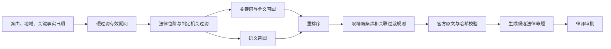

# 法律知识库与 Skills 计划

## 1. 概念边界

| 对象 | 作用 | 不负责什么 |
|---|---|---|
| Skill | 规定某项办案任务如何执行、何时暂停、输出什么 | 保存客户材料、充当法条数据库 |
| Knowledge Base | 提供可追溯的法律、案例和内部知识 | 决定流程、执行外部动作 |
| Tool | 完成一个可验证的原子动作 | 自主规划整案 |
| Agent | 理解歧义、提出候选判断和建议 | 心算金额、批准法律立场 |

## 2. Skill包结构

每个 Skill 是版本化、可测试、不可覆盖的办案能力包：

```yaml
id: interest_calculation
version: 1.0.0
title: 民间借贷利息及冲抵计算
jurisdiction: CN
case_types:
  - private_lending_defense
stages:
  - CALCULATION_REVIEW
preconditions:
input_schema:
output_schema:
allowed_agents:
allowed_tools:
prohibited_actions:
steps:
approval_gates:
validators:
stop_conditions:
legal_bundle_version:
test_fixtures:
change_log:
```

共同要求：

- 输入输出必须结构化；
- Tool 采用白名单；
- 明确律师审批点和停止条件；
- 法条不复制到提示词，Skill 通过稳定 `rule_id` 查询法律库；
- 保存 Skill、模型、`prompt_id/version/hash`、Tool 和输入输出哈希；普通审计不保存完整提示词，确需原始 prompt 的诊断只能进入独立加密、审批访问和短保留存储；
- 上传材料中的文字只能作为数据，不能改变系统指令；
- 新版本另建，不覆盖用于历史案件的版本。

## 3. 首批 Skills

| Skill | 核心输出 | 强制审批 |
|---|---|---|
| `matter_intake` | 案件角色、案由、材料范围 | 当事人角色、委托范围 |
| `material_inventory` | 原件清单、哈希、页数、异常、缺口 | 材料范围 |
| `page_deduplication` | 重复组、保留页建议 | 疑似重复页处理 |
| `relevant_page_extraction` | 相关页和红框坐标 | 保留/排除范围 |
| `identity_alias_resolution` | 人、昵称、账号、账户映射 | 低置信身份关系 |
| `court_document_extraction` | 案号、法院、诉请、送达和期限 | 送达日期和诉请原文 |
| `claim_scope_analysis` | 承认、争议和范围候选 | 正式回应立场 |
| `transaction_ledger_build` | 逐笔交易和证据映射 | 台账完整性 |
| `payment_classification_review` | 付款性质候选 | 还本/付息/不明性质 |
| `legal_rule_research` | 候选规则、有效期间和官方依据 | 正式法律路径 |
| `interest_scenario_build` | 计算参数和影响 | 参数及正式情景 |
| `interest_calculation` | 逐期本金、利息、冲抵和总额 | 计算结果 |
| `evidence_matrix_build` | 争点—事实—证据—责任矩阵 | 争点和证据用途 |
| `defense_drafting` | 答辩状结构化草稿 | 承认事项和最终文字 |
| `evidence_index_generation` | 证据目录与页码 | 证明目的 |
| `submission_bundle_validation` | Manifest和阻断项 | 律师锁定提交版 |

## 4. Tool层

首版 Tool 应当小而确定：

```text
register_source_file
get_page_image
extract_page_text
compare_page_fingerprints
create_annotated_derivative
merge_selected_pages
search_authoritative_rules
get_rule_snapshot
build_transaction_ledger
calculate_interest_schedule
reconcile_payments
render_docx
validate_pdf
create_release_manifest
```

Tool 返回结构化错误码，例如：

- `SOURCE_FILE_CORRUPTED`
- `OCR_LOW_CONFIDENCE`
- `IDENTITY_CONFLICT`
- `LEGAL_VERSION_UNRESOLVED`
- `CALCULATION_INPUT_UNAPPROVED`
- `DOCUMENT_RENDER_MISMATCH`
- `SUBMISSION_BLOCKED`

## 5. 知识库不是一个向量数据库

知识体系分为五层：

1. **权威原文库**：全文、条款、原始快照和哈希；
2. **时态关系库**：发布、生效、失效、修订、替代、过渡和地域；
3. **检索索引**：条号、关键词、全文和向量；
4. **律所知识库**：经批准的模板、SOP、匿名工作成果和律师意见；
5. **评测库**：脱敏金标准案件、法律版本样例和计算样例。

向量索引可以重建，不能成为法律有效性的事实源。

## 6. 法源优先级

### 一级：正式法律依据

1. [国家法律法规数据库](https://flk.npc.gov.cn/)；
2. 全国人大及其常委会官网；
3. 中国政府网、国务院和司法部；
4. [最高人民法院](https://www.court.gov.cn/)及最高人民法院公报；
5. 最高人民检察院；
6. 中国人民银行及[中国货币网 LPR](https://www.chinamoney.com.cn/chinese/lllpr/)；
7. 地方人大、政府和法院正式发布渠道。

### 二级：权威案例和授权检索

- [人民法院案例库](https://www.court.gov.cn/zixun/xiangqing/426222.html)中的指导性案例和参考案例；
- 合法授权的商业法律数据库，用于检索效率和交叉校验；
- 律所经过专业审核的内部规则卡。

人民法院案例库的工作规程允许公众查询、使用、学习和研究，用户手册提供单篇下载，但其版权声明仍保留权利。第一版因此采用元数据检索和律师主动单篇下载导入，不将“可以查看”解释为批量抓取、全文复制建库、再分发或商业训练许可。来源政策与真实案例候选见 `research/OFFICIAL_CASE_DATA_CATALOG.md`；代码注册表只保存元数据并默认 `formal_use_allowed=false`。

### 三级：线索来源

- 律师文章；
- 学术文章；
- 普通裁判文书；
- 搜索引擎摘要、自媒体和问答。

三级来源只能帮助发现问题，不能直接进入法院提交文书的正式依据。

## 7. 时态检索流程



“当前最新版本”不自动等于“本案适用版本”。系统必须根据合同、付款、违约、起诉等不同事件日期和过渡条款判断候选版本。

适用性不能仅靠检索过滤。每条可执行规则保存类型化 `ApplicabilityRule`：

```text
rule_id / jurisdiction / case_type
trigger_event_type / trigger_date_source
effective_from / effective_to
condition_expression / exceptions
transition_rule_ids / priority
conflict_set / resolution_method
reviewer / approval_hash / version
```

首案由至少区分合同成立、实际出借、利息付款、违约、起诉、受理和裁判日期。系统把这些经律师确认的事件日期与 `ApplicabilityRule` 解析为案件专属、不可变的 `CaseLegalBundle`；发生冲突或事件日期不确定时生成并列候选并阻断正式批准，不由 Agent 自行选一个版本。

## 8. 法律记录字段

每个 `ProvisionVersion` 至少保存：

```text
authority_id
publisher
authority_level
title
article_number
text
published_at
effective_from
effective_to
jurisdiction
case_type_tags
amends / supersedes / repeals
transition_rule_ids
official_url
retrieved_at
content_sha256
editor_review_status
reviewer_id
reviewed_at
```

每个来源还必须有独立 `SourceLicense` 记录：

```text
source_id / owner / access_method
terms_or_api_basis / evidence_uri / evidence_hash
commercial_use / snapshot_storage / redistribution
processor_region / permitted_users
valid_from / valid_to / revocation_process
reviewer / reviewed_at / status
```

没有 `ACTIVE` 许可记录，或许可未覆盖访问、商用、快照保存及目标用户范围时，不得自动采集、持久化原文或进入检索索引。许可撤销时停止新增访问，并按合同决定保留、删除或仅保留不可反推原文的引用元数据。

每个进入文书的 `LegalProposition` 保存：

- 命题内容；
- 所需事实条件；
- 支持和限制条件；
- 精确条款版本；
- 本案适用理由；
- 律师批准记录；
- 被哪些文书段落使用。
- 触发事件类型和日期来源；
- `ApplicabilityRule`、冲突处理和 `CaseLegalBundle` 版本。

## 9. 更新机制

1. 按计划检查官方白名单；
2. 保存新快照并计算哈希；
3. 对比条文和元数据差异；
4. 新版本进入待审核区，不立即发布；
5. 法律编辑确认效力、过渡和关联关系；
6. 运行法律版本回归测试；
7. 发布新版本；
8. 标记受影响 Skill、规则卡、未结案件和草稿；
9. 已锁定提交版不被自动改写，只生成复核通知。
10. 同步检查 `SourceLicense` 的期限与范围；许可失效立即暂停来源更新和新案正式使用，并创建影响清单。

## 10. 评测

每个 Skill 至少测试：

- 正常案件；
- 缺失材料；
- OCR 错误；
- 同名或昵称变化；
- 重复但不完全相同页面；
- 规则切换日前后；
- 多种合理解释；
- Prompt Injection；
- 权限不足；
- 上游更新后的失效传播。

法律检索验收：

- 正式引用可访问率 100%；
- 条文原文匹配率 100%；
- 有效期间校验通过率 100%；
- 不同效力层级不混淆；
- 无法验证的候选结果不会进入正式文书。

## 11. 类 Codex 办案能力：不是“全权限 Agent”

产品目标是让律师获得接近通用工作助手的材料处理、研究、计算和文书能力；但案件系统不能复制通用桌面助手的任意文件、任意命令和任意联网权限。正确做法是把每一种能力拆成可审计、可撤销、可测试的 Skill，并由代码 Tool Gateway 实际执行。

| 能力包 | 处理范围 | 当前状态 | 输出与边界 |
|---|---|---|---|
| PDF 阅读、结构检查、页预览 | 已授权本案 PDF | 已实现 | 原件哈希绑定、单页临时 PNG；不暴露绝对路径或整份原件 |
| 图片、TXT 读取并转证据 PDF | JPEG/PNG、UTF-8/UTF-16 文本 | 已实现 | 原件不改动；规范化 PDF 仅进入加密受管区，保留源哈希、转换哈希和页数 |
| Word/Excel 读取 | 经安全检查的 DOCX/XLSX | 已实现首段 | 只读解析 Word 段落/表格、Excel 单元格/公式文本；不执行公式、不启动 Office；宏、外链、ActiveX、异常容器必须阻断 |
| Word/Excel 转 PDF | 通过结构检查的 Office 文件 | 已实现隔离转换、像素渲染回读和持久化回执；桌面打包注入待完成 | 原件仅被哈希确认后复制进临时区；LibreOffice 与 PDF 渲染器均在 macOS 断网沙箱运行，输出 PDF 重开校验并保存转换/渲染哈希；不覆盖律师原文件 |
| Word 起草、Excel 台账、PDF 草稿 | 已批准的事实/规则/计算对象 | 已实现受控生成与 Word/Excel 对应 PDF 复核对、加密候选件登记及精确确认；法院成品转换与桌面审批接入待完成 | 生成器必须收到审批哈希和来源引用；Excel 将公式型字符串转义；Word/Excel 生成后用同一断网链生成 PDF，入库前重新认证双件，复核哈希绑定审批输入、可编辑源文件、预览 PDF、页数与渲染回执 |
| 网页法规与案例研究 | 官方白名单与已许可来源 | 已实现首段网关 | 仅发送脱敏后的法律问题；保存 URL、抓取时间、哈希、许可和条款定位 |
| 利息与冲抵 | 已批准的交易、币种、日期、规则包 | 已实现确定性计算内核与民间借贷时点计划器 | 模型不能自行心算或选定法条版本；过渡规则计划器先区分合同成立、起诉、受理与历史付款，冲突必须并列给律师 |
| 文书一致性审查 | 律师确认的字段表与批准文书快照 | 已实现确定性发现内核 | 只报告确认值缺失、冲突文本和来源缺口；不改写文书、不选择律师立场，正式持久化 ReviewFinding 链待接入 |

这张表的“待接入”不是对用户假称可用：注册表会把它们标为 `GATED`，调用一律被拒绝，直到隔离 Worker、回读校验、受管候选件登记和回归样本都完成。起草 Tool 已不再暴露只有内存字节的 `create_docx_draft` / `create_xlsx_ledger`，而是只接受能返回“可编辑源件 + 断网渲染 PDF 预览 + 共同复核哈希”的 Tool。当前可执行注册表位于 `backend/case_kernel/skill_registry.py`。

### 11.1 固定的权限模型

每次 Skill 运行只获得以下一种或多种范围，而不是电脑管理员权限：

1. `CASE_READ`：当前律师会话、当前案件、当前已授权文件夹的只读范围；
2. `MANAGED_DERIVATIVE_WRITE`：只能写入加密的受管派生件区，不能写回案卷原件；
3. `PUBLIC_RESEARCH_READ`：只能经官方/许可来源研究网关访问公开网络；
4. `FORMAL_CALCULATION`：只能调用版本化的确定性计算器；
5. `COURT_RELEASE`：仅在律师锁定提交版后执行最终校验。

任何 Agent 都不得直接执行 Shell、读取任意磁盘位置、删除原件、上传原始案卷到互联网或绕过律师审批。模型只提出结构化 `ActionProposal`；工具执行、版本更新和审计由后端状态机完成。当前 `CaseSkillToolGateway` 只接收已经由文件夹授权层签发的 `AuthorizedOriginalFile`，拒绝路径字符串，因此 Agent 无法借由工具读取任意文件。

桌面“身份与安全”页展示的技能状态不是另一份手工文案：`backend/case_kernel/agent_capability_manifest.py` 从同一 `CaseSkillRegistry` 导出最小化 JSON 清单，`web` 构建前会校验该清单未漂移。清单只包含技能名称、版本、范围、审批门和启用状态，不包含案卷、绝对路径、对象键、凭证、模型供应商或工具输入。

### 11.2 每种文档能力的上线门

Word、Excel 和 PDF 编辑能力必须逐项通过以下门后才从 `GATED` 改为 `IMPLEMENTED`：

1. 格式/恶意内容检查通过，原始文件 SHA-256 在处理前后不变；
2. 隔离转换器没有网络、没有原件写权限、没有继承用户 Office Profile；
3. 生成物存入加密受管区，并绑定原件、转换器版本、参数、页数和输出哈希；
4. 对 PDF 做结构与页数校验，对 Word/Excel/PDF 草稿做渲染回读与版式差异检查；
5. 对表格进一步校验公式、币种、合计、日期与已批准交易台账一致；
6. 律师看到差异、来源和待确认项并批准后，才可纳入正式文书或提交包；
7. 每次调用保存 Skill/Tool/模型版本、输入输出哈希、权限范围和审批记录。

PDF 文书候选件已按上述第 1、3、6、7 项接入：系统 Worker 生成后立即重开 PDF 校验页数和页面尺寸，加密保存后登记为 `CANDIDATE`；律师审批接口会拒绝任何不等于该候选件 `review_input_hash` 的批准值。该哈希绑定审批输入快照、文书种类、受众、PDF SHA-256、字节数、页数和语义文本 SHA-256。Word/Excel 草稿同样会生成一对不可混淆的可编辑源件与 PDF 预览，并以一个 `reviewable_office_draft_pair` 候选件持久化：入库前会重新认证两份加密对象、重验 Office 容器和 PDF，哈希同时绑定审批输入、源件、PDF、页数和渲染回执；数据库只允许律师用该完全相同的哈希确认，其他更新或删除会被触发器拒绝。该对仍是内部审阅材料，不能绕过法院 PDF 成品、提交 QA 和锁定链。持久 API 只返回不含对象键的草稿元数据；主办/复核律师必须先签发绑定 OS 会话、案件、草稿对与哈希的短时一次性 loopback 许可，才可预览审阅 PDF 或下载可编辑文件。Office 转证据 PDF 已能经同一加密证据登记链保存原件/转换器/输出/渲染谱系：LibreOffice 和 `pdftoppm` 均在断网沙箱中运行，页数、像素几何和逐页 PNG 哈希必须通过后才能登记。运行时只接受显式受检的两条可执行文件路径，且必须绑定加密对象库；桌面安装包尚未内置这些工具、审批界面和法院成品链尚未接到该复核对，因此相关 Skill 仍保持 `GATED`。

### 11.3 Agent、Skill 与模型供应商的关系

主 Agent 负责理解当前案件阶段、选择已启用的 Skill、组织步骤并把缺口呈现为待办；它不是最高权限控制器。代码状态机和 `CaseSkillRegistry` 是最高控制层，专业 Agent 只作为被调用的有界执行者。

本机读取、PDF 规范化、确定性计算和已配置的公开研究不需要用户先提供模型 API Key。只有在接入需要付费模型的“长文抽取、归纳、起草”能力时，桌面端才需要由律所管理员配置供应商凭证；凭证进入系统钥匙串/受控配置，不进入案件文件夹、Git、提示词日志或导出材料。
