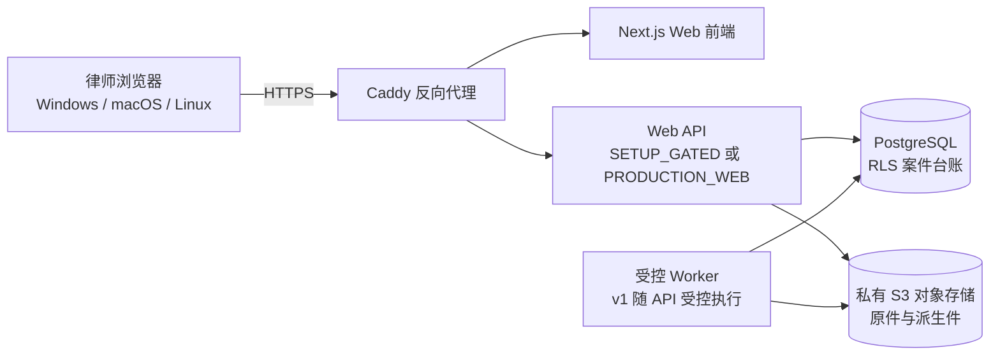

# 自托管 Web 工作台部署说明

律师正式使用只有一个入口：律所管理员部署的受管 Web 工作台。开发人员若只需验证基础材料链，可使用 [离线开发模式](LOCAL_WEB.md)；该模式不是律师商用入口，也不承诺完整 Agent。

管理员首先使用统一入口准备和预检完整单机服务器组合：

```text
python3 scripts/manage_managed_web.py init
python3 scripts/manage_managed_web.py preflight
python3 scripts/manage_managed_web.py start
```

`start` 会在配置缺失或宿主可用空间低于 5 GiB 时停止，绝不回退为离线 SQLite 模式，也不会先停止旧容器再冒险构建。完整组合运行在一台律所管理的 Linux 服务器或私有云虚拟机；律师端只需要浏览器，不需要安装 OIDC、PostgreSQL、对象存储、ClamAV、Poppler 或 LibreOffice。

## 先说明当前状态

产品入口已经是跨平台浏览器 Web 工作台：律师从同源 OIDC 登录进入，建立真实案件，明确选择 PDF，服务端扫描并入库，随后逐页预览、纳入/排除、红框确认、锁定证据清单，并提交两份证据 PDF 的受控生成任务；案件要点页还会读取同一案件的事实、诉请、争点和交易台账。浏览器不读取本机文件夹、不保存访问令牌、不接触原始 PDF 或对象存储地址。

Compose 默认仍是 `SETUP_GATED`，这是安全的首次启动状态；它只验证容器连通性，不开放真实案件路由。必须强调：随附 Compose 和管理员入口构成了**可预检、可启动的部署组合骨架，但不是已经通过商用验收的闭合方案**。它没有创建三套最小权限数据库身份、自动执行完整迁移，也没有把开发用 HTTP MinIO 变成满足生产运行时要求的 TLS/KMS 对象库。律所完成外部 OIDC、三套 TLS 校验 PostgreSQL、私有 TLS 对象存储、ClamAV、Poppler 和 system worker 配置后，将 `LAWCASE_WEB_RUNTIME_MODE` 改为 `PRODUCTION_WEB`，API 才会装配真实 Web 运行时。配置不完整时进程会 fail-closed，不会退回演示案件或离线 SQLite。

## 部署形态



只有 Caddy 对外暴露端口。PostgreSQL、对象存储控制台和 API 都只在 Docker 私有网络中通信。浏览器应始终使用同一 HTTPS 域名访问前端和 API，避免把身份令牌交给跨域页面。

## 文件说明

| 文件 | 作用 |
| --- | --- |
| `deployment/web/compose.yaml` | 跨平台 Compose 编排：网关、前端、API 前置门、PostgreSQL、私有对象存储。 |
| `deployment/web/Caddyfile` | HTTPS 反向代理与基础浏览器安全响应头。 |
| `deployment/web/frontend.Dockerfile` | 构建 Next.js standalone 服务器，不包含 Tauri、桌面二进制或本机案件文件。 |
| `deployment/web/api.Dockerfile` | 安装 Web API、ClamAV 和 Poppler；`SETUP_GATED` 时仍只挂载前置门，生产配置完整后才运行真实 API。 |
| `deployment/web/api-gate.py` | `SETUP_GATED` 的明确阻断 API；健康检查可用不代表案件 API 可用。 |
| `deployment/web/.env.example` | 非秘密占位配置。复制为 `.env` 后必须替换密码。 |

## 第一次本机烟雾检查

前提是安装 Docker Compose v2：Windows 使用 Docker Desktop + WSL2；macOS 使用 Docker Desktop（Intel 或 Apple Silicon）；Linux 使用 Docker Engine 与 Compose plugin。浏览器端不依赖操作系统，未来支持 Chrome、Edge、Firefox 和 Safari。

macOS/Linux：

```sh
cd deployment/web
cp .env.example .env
# 编辑 .env：至少替换两个密码占位符
docker compose --env-file .env config --quiet
docker compose --env-file .env up --build -d
curl -k https://localhost:8443/healthz
curl -k https://localhost:8443/setup-status
```

Windows PowerShell：

```powershell
Set-Location deployment/web
Copy-Item .env.example .env
# 编辑 .env：至少替换两个密码占位符
docker compose --env-file .env config --quiet
docker compose --env-file .env up --build -d
curl.exe -k https://localhost:8443/healthz
curl.exe -k https://localhost:8443/setup-status
```

预期结果：默认 `SETUP_GATED` 时 `/healthz` 返回 HTTP 200，`/setup-status` 返回 HTTP 503，明确说明真实案件路由未启用。这只证明容器连通性，不证明产品已可办案。完成生产配置后，将 `LAWCASE_WEB_RUNTIME_MODE=PRODUCTION_WEB`，并用律所域名和受信 HTTPS 证书重启；此时 `/healthz` 必须显示 `self-hosted-web`，`/setup-status` 和 `/readyz` 返回 `PRODUCTION_WEB_CONFIGURED`，`/api/v1/session` 未登录返回 401，不能再看到演示案件。配置状态接口只证明服务装配完成，数据库、对象存储和身份供应商的实时连通性仍须由部署验收记录证明。`localhost` 的本地开发证书仅用于烟雾检查。

在服务器启用生产模式前，可运行只读静态预检：

```sh
PYTHONPATH=backend backend/.venv/bin/python backend/scripts/web_deployment_readiness.py --json
```

它会检查 `PRODUCTION_WEB` 环境变量结构、0001—0027 完整依赖迁移文件、ClamAV、Poppler 和律所 `SYSTEM_WORKER` 配置，但永远返回 `release_authorized=false`；真实登录、数据库/对象存储连通性、备份恢复和律师浏览器流程仍必须留下人工验收记录。

部署到律所服务器前，应把 `LAWCASE_PUBLIC_HOST` 改为受控 DNS 名称、保持 HTTPS 443 可达、在防火墙中只开放 Caddy 的端口，并将 `LAWCASE_BIND_ADDRESS` 与端口映射改为经运维批准的值。不要把 PostgreSQL 5432、对象存储 9000/9001 或 API 8080 映射到宿主机。

## 资料接收的跨浏览器原则

“律师把资料放在本机文件夹中”在 Web 形态下不能等同于服务器能读取该目录。浏览器只能在律师明确选择后取得文件副本；服务器端受管对象库才是案件材料的正式来源。

第一版材料入口应同时提供：

1. 多文件选择与拖放：所有支持的桌面浏览器都必须能走这条路径；
2. ZIP 上传：保留原有目录层级，是跨浏览器的可靠整卷兜底；
3. 文件夹选择：仅作渐进增强，浏览器能力检测后才显示，不能成为唯一入口；
4. 可恢复的大文件分片上传：上传会话、每片哈希、服务端合并哈希和超限/病毒扫描状态必须可审计；
5. 可选的跨平台同步连接器：只有在律所确实需要持续监控本机目录时再做，且它应是单独受控组件，不是 Web 页面取得任意磁盘权限的替代品。

Chrome 的 File System Access API 只适合渐进增强；它不能完整 polyfill 到所有浏览器。`webkitdirectory` 虽已覆盖较多现代浏览器，仍带有 WebKit 前缀且不同版本的层级行为存在差异。因此正式证据链必须以“已上传的文件或 ZIP 内条目 + 服务端 SHA-256 + 受管对象 ID”为准，而不是本机绝对路径或浏览器文件句柄。

## 当前 Web 功能矩阵

| 律师入口 | 当前状态 | 可验证边界 |
| --- | --- | --- |
| 登录、案件列表、建立案件 | 已接入 Web API | OIDC + MFA、服务端角色和同源会话；未登录不返回案件 |
| PDF 材料接收 | 已接入 Web API | 服务端接收位、流式校验、扫描、私有对象绑定；结果不明时禁止重复上传 |
| ZIP 材料包接收 | 已接入安全接收切片 | 服务器校验路径、符号链接、加密、重复文件名、解压上限、CRC 与哈希后形成待处理回执；逐文件 PDF Worker 尚未放行 |
| 逐页预览、纳入/排除、红框、锁定 | 已接入 Web API | 只返回单页 PNG；所有决定必须先候选、再由律师确认 |
| 两份相关页面 PDF | 已接入 Web API | 锁定清单后由受控 Worker 生成并复核，浏览器只能下载已验证派生件 |
| 案件要点、诉请、收付款核对 | 已接入 Web API | 从同案 PostgreSQL 台账返回；主办律师可确认事实、诉请范围和收付款，决定哈希由服务端生成 |
| 法律依据只读核对 | 已接入 Web API | 读取已登记官方法源、规则版本和法律事件；不自动选择适用规则 |
| 正式利息测算 | 已接入受控入口 | 主办律师明确提交义务编号、期间和抵扣顺序；服务端绑定批准规则包、复核确认交易并独立计算，前置不满足时不显示金额 |
| 法院应诉包前置核对 | 已接入只读 Web API | 读取同案文书候选、材料包生命周期、证据/规则/测算绑定和导出核验；不暴露对象存储地址 |
| 整案 Agent 分析与候选分组 | 未接入生产 Web | 当前本机仅有确定性文本预处理；代码总控、模型 Worker、候选批次和批量确认仍在 P0 实施 |
| Word/Excel/PDF 文书候选 | 代码链已存在，生产接线待验收 | 仅服务端从已确认案情生成，需显式配置 LibreOffice Worker；候选先审阅/审批，未自动进入法院提交包 |
| 法院应诉包写入与下载 | 按前置条件锁定 | 需在正式测算、证据锁定、文书审批和提交核对全部完成后开放，暂不展示演示结论 |

因此，看到“应诉材料”处于待开放并不代表网页故障；“还款与利息”虽然已有入口，但服务端尚未满足可追溯前置条件时会拒绝计算并不显示金额。商用验收应先完成材料、案情、法源和规则包，再单独验收正式测算与应诉包；不能用 `/healthz` 或页面显示代替真实登录、数据库、对象存储和浏览器流程。

案件首页的“办案前置状态”会按当前案件版本返回每个前置项的 `READY/BLOCKED` 和下一步说明。它只是服务端读取投影，不会替律师确认事实、选择规则或批准利息计算；前置项状态必须以同一案件版本的真实回执为准。

## PDF、逐页筛选与红框的服务器链

Web 运行时按以下顺序执行，原件永不被覆盖：

```text
浏览器明确选择 PDF（多文件/文件夹增强）
→ 隔离临时区 / 哈希 / 恶意内容和格式检查
→ 私有对象库保存原件
→ 证据原件与页级记录
→ 受控 Worker 渲染单页 PNG
→ Agent 先按相关性、风险、冲突和 OCR 异常分组
→ 律师批量复核低风险候选、单独处理异常并确认红框
→ 锁定 Manifest
→ 提交受控 Worker 生成 related-pages.pdf 和 related-pages-red-box.pdf
→ Worker 完成校验并写入私有对象库

ZIP 材料包走独立的归档接收状态机：先私有暂存并完整验证归档安全属性，回执为 `STORED_PENDING_PROCESSING`；在逐文件 Worker 完成扫描、登记和案件版本推进前，不会显示为已入卷 PDF。当前 Web 入口仍未宣称分片断点上传已完成。
→ 同源、短时、审计绑定的下载响应
```

当前 v1 的 Worker 由单一 Web API 进程以受控后台任务执行；运行时因此强制
`SINGLE_API_PROCESS`，不会假装具备多副本队列能力。任务失败会保留为失败状态，
不能诱导律师重复上传或重复生成；正式商用扩容前仍需把同一状态机接入独立、可恢复的
私有 Worker 队列，并完成进程重启与租约恢复验收。

现有 `backend/case_kernel/evidence_intake_worker.py`、`pdf_reading_worker.py`、`evidence_derivative_worker.py`、`evidence_manifest_postgres.py`、`calculation_engine.py` 和 `submission_bundle_compiler.py` 是可迁移的领域/确定性处理基础；它们必须从“本机文件夹授权”改为“服务器端已验证对象引用”，不能由浏览器提交页数、哈希、路径或安全结论。

## 真实放行前必须完成的门

1. **Web 身份**：实现 OIDC + MFA 的 `ServerIdentityResolver`，从服务端会话导出用户、律所和角色；使用 `Secure`、`HttpOnly`、`SameSite` Cookie 与 CSRF 防护，不将访问令牌放到 `localStorage`。
2. **租户隔离**：保留现有 PostgreSQL 的 `firm_id`、案件角色和强制 RLS；每次事务继续 `SET LOCAL app.firm_id`，数据库运行账户不得拥有 `BYPASSRLS`。对象键、加密上下文和下载授权也必须绑定 firm/matter/user，不能利用跨律所内容去重推测文件存在性。
3. **对象存储**：用服务器 KMS/密钥管理替代 macOS Keychain；采用每律所或每案件的加密上下文、私有 bucket、短时服务端签发访问。当前 Compose 使用 MinIO 只是 S3 兼容开发占位，正式商用前还必须完成供应商许可、镜像、备份和密钥轮换审查。
4. **上传隔离**：建立流式/分片接收、尺寸和压缩炸弹上限、恶意样本扫描、格式检查、可恢复队列和只读原件谱系。失败不能回退为“已接收”。
5. **受控 Worker**：PDF 派生的 v1 单进程 Worker 已按专用 `SYSTEM_WORKER` 身份、锁定 Manifest 和私有对象句柄执行；Office 转换、法源抓取和模型调用仍需接入独立可恢复 Worker 队列，不能读取宿主机任意路径。
6. **浏览器 API**：将 `persistent_api_client.ts` 的 Tauri grant 逻辑替换为同源 Web 会话客户端；CORS 默认关闭（同源），写操作使用幂等键、版本号和 CSRF 校验。
7. **运行与恢复**：受控迁移/回滚、加密离机备份、对象库与数据库一致性恢复、审计不可覆盖、漏洞扫描、镜像签名、日志脱敏和 Windows/macOS 浏览器端到端验收都必须留存证据；验收样例还必须覆盖事实/规则/测算前置阻断和提交包锁定。

## 当前不能做的事

- 不要向这个 Compose 栈上传真实案卷；
- 不要将当前 Tauri loopback API、macOS Keychain 凭证或本机文件夹 grant 通过反向代理公开；
- 不要把 `/healthz` 的成功解释为数据库迁移、Web 登录、上传、PDF 红框、Agent、利息计算或法院提交已可用；
- 不要把对象存储控制台公开到互联网；
- 不要把模型 API Key 写进 `.env.example`、浏览器配置或案件目录。

## 本次静态验收

本次只应运行 Compose 结构检查和文件级静态检查，不在开发机拉取镜像或构建容器。真实构建、镜像漏洞扫描、数据库迁移和端到端浏览器验收属于上述 Web 运行时完成后的独立放行门。
